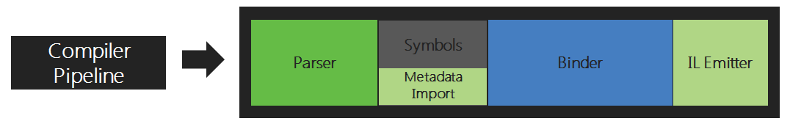

# The little X# programming guide

version 0.1
last update: 06/10/22

**Disclaimer:** This is neither a complete guide nor a rehash of the official X# documentation.

So what is it? Its a light introduction to the X# language by using examples instead of textual descriptions. Its aimed for developers who alreay know a language like VO, Visual Basic or even C# and like to start with X#.

Please always refer to the X# documentation by the X# team for any reference or if you are in doubt about anything written in this document.

## Naming conventions

This topic is really hard because there is no official naming convention and if you ask developers about the conventions you will probably get two kind of ansers:

1. We don't use any conventions
2. We use our own conventions

I think we can all (hopefully) agree that using the good old _Hungaring notation_ is not something that fits for being in the 21st century.

## The impact of Roslyn

You may have read this at several occasions. X# sits on top of Roslyn (so to speak) or is based on Roslyn or depends on Roslyn.

Roslyn is just one of these Microsoft "codewords" that the company used extensively in the 80ties and 90ties - like jackets with rolled up sleeves (for example the one that Michael Jackson wore in the famous Thriller video).

The official name is *.NET Compiler platform*.

*(all the pictures in this section have the copyright of Microsoft - taken from https://docs.microsoft.com/en-us/dotnet/csharp/roslyn-sdk/compiler-api-model)*

*Fig 1: the Compiler Pipeline*

## Data types

Since X# is based on the CLR (_Common Language Runtime_) of the underlying .NET runtime it has to use the same datatypes. But they do not have to hame the same names of couse.

